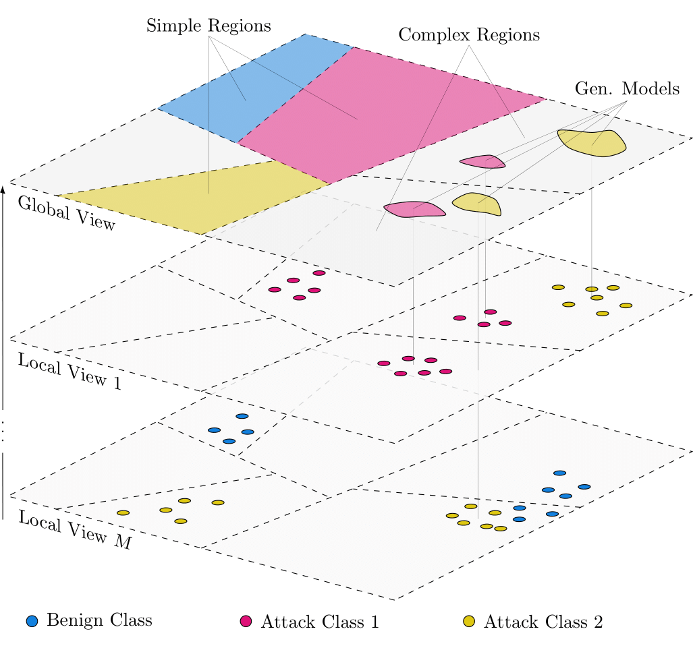

# Masters-Thesis
## Generative Pattern Dissemination for Collaborative Intrusion Detection

**Abstract**

The continuous blurring of corporate boundaries induced by the development of globally networked supply chains and the associated interconnection of IT infrastructures is increasing the potential attack surface and velocity of cyber attacks, which requires the development of innovative defense solutions.
CIDSs attempt to improve attack detection with intelligent mechanisms for information sharing and correlation.
All approaches that implement techniques for data dissemination in CIDS face the same key challenges.
To begin, privacy must be ensured when exchanging sensitive data, while on the other hand the usability of the data for subsequent applications, such as ML-based classification, must not be compromised. 
Similarly, the information exchange itself is subject to a trade-off between rapid dissemination among members, i.e. minimal overhead, and the quality of the data.
Finally, interoperability must be ensured so that collaboration between different local IDSs is enabled in the first place.
In this context, a novel CIDS that exchanges the parameters of generative machine learning models, is presented. 
Specifically, data sets are partitioned using LSH and persisted locally in a key-value store by using a corresponding hash value as a component for the key creation.
This way, updates on specific regions are propagated automatically downstream through the processing pipeline, where regions are classified on a global level as either complex or simple with respect to the number of classes they contain.
Complex regions are subject to the generative model selection process. The respective data partition in a region serves as input for the training of a GMM, whose parameters in turn is shared among members of the CIDS.
An event-based streaming application implements the proposed approach and guarantees a fast distribution of information.
By compressing local data into generative models, the exchanged data volume is reduced, likewise supporting data privacy.
Processing latency is shortened by exploiting parallelization induced by the data partitioning.
By exchanging only hashed values, model parameters and class labels, data privacy is preserved. 
Multiclass classification experiments on multiple network intrusion datasets demonstrate a superior performance of this approach in comparison to local detection schemes.

